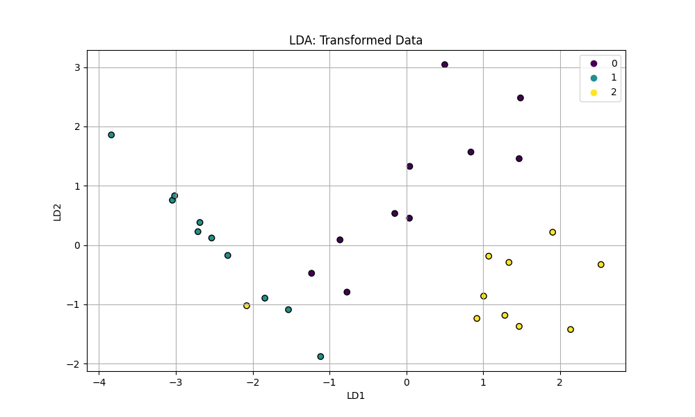
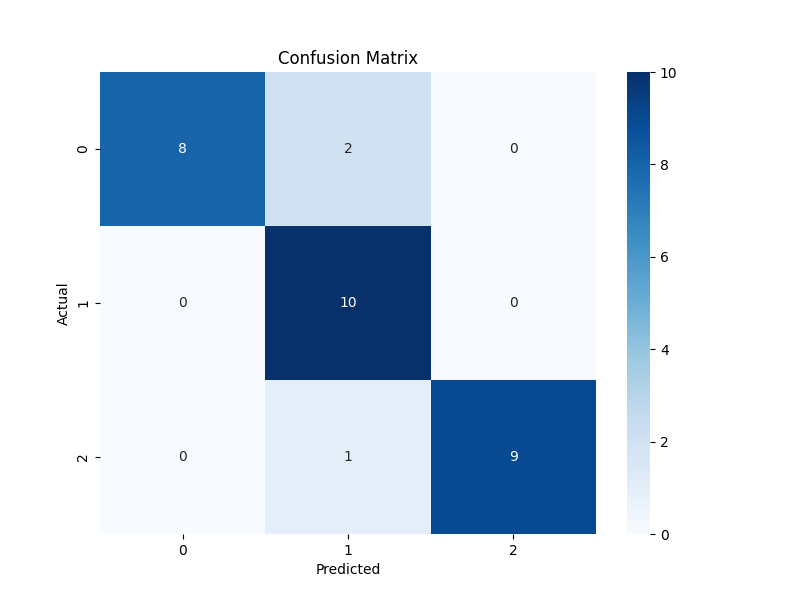

# Linear Discriminant Analysis (LDA) for Dimensionality Reduction

## Overview

This project is a Proof-of-Concept (PoC) demonstrating the use of Linear Discriminant Analysis (LDA) for dimensionality reduction. It includes data generation, model training, evaluation, and experiment tracking with MLflow. This project is designed to showcase a complete MLOps pipeline for a classic machine learning algorithm.

## Linear Discriminant Analysis (LDA) Explained

### Core Concepts

Linear Discriminant Analysis (LDA) is a supervised machine learning algorithm used for both classification and dimensionality reduction. The primary goal of LDA is to project a dataset onto a lower-dimensional space with good class separability. It finds the directions (linear discriminants) that maximize the separation between multiple classes.

LDA works by finding a new set of axes (the linear discriminants) such that when the data is projected onto these axes, the between-class variance is maximized and the within-class variance is minimized.

### Mathematical Formulation

The objective of LDA is to find a projection matrix W that maximizes the ratio of the between-class scatter matrix (SB) to the within-class scatter matrix (SW).

**1. Within-Class Scatter Matrix (SW):**

SW measures the scatter of data points within each class. It is calculated as the sum of the covariance matrices for each class.

SW = Σ (from c=1 to C) Sc

where Sc is the scatter matrix for each class c, and C is the number of classes.

Sc = Σ (from x in Dc) (x - μ_c)(x - μ_c)^T

where Dc is the set of data points in class c, and μ_c is the mean of class c.

**2. Between-Class Scatter Matrix (SB):**

SB measures the scatter of the class means around the overall mean of the data.

SB = Σ (from c=1 to C) Nc(μ_c - μ)(μ_c - μ)^T

where Nc is the number of data points in class c, μ_c is the mean of class c, and μ is the overall mean of the data.

**3. Optimization Objective:**

The objective is to find the projection matrix W that maximizes the following ratio:

J(W) = det(W^T * SB * W) / det(W^T * SW * W)

This is a generalized eigenvalue problem, which can be solved by finding the eigenvectors of the matrix SW^(-1) * SB.

The columns of the optimal projection matrix W are the eigenvectors corresponding to the largest eigenvalues of SW^(-1) * SB. The number of eigenvectors to choose corresponds to the desired number of dimensions (n_components).

### Use Cases

- **Face Recognition:** LDA is used to reduce the dimensionality of facial images, making the recognition process more efficient.
- **Medical Diagnosis:** In medical applications, LDA can be used to classify patients into different categories (e.g., healthy vs. diseased) based on a set of medical measurements.
- **Marketing:** LDA can be used to identify customer segments based on their purchasing behavior.
- **Bioinformatics:** In genomics, LDA can be used to classify tissue samples based on gene expression data.

## Project Structure

```
LDA/
├─── README.md
├─── requirements.txt
├─── data/
│   └─── lda_data.csv
├─── images/
│   ├─── lda_plot.png
│   └─── confusion_matrix.png
├─── src/
│   ├─── data_generation.py
│   ├─── train.py
│   ├─── evaluate.py
│   └─── lda_model.pkl
└─── mlruns/
```

## Installation

1.  **Clone the repository:**

    ```bash
    git clone <repository-url>
    cd LDA
    ```

2.  **Create a virtual environment (optional but recommended):**

    ```bash
    python -m venv venv
    source venv/bin/activate  # On Windows, use `venv\Scripts\activate`
    ```

3.  **Install the dependencies:**

    ```bash
    pip install -r requirements.txt
    ```

## Usage

### 1. Data Generation

This step generates a synthetic dataset for the LDA model.

```bash
python src/data_generation.py
```

This will create a `lda_data.csv` file in the `data` directory.

### 2. Training

This step trains the LDA model and logs the experiment with MLflow.

```bash
python src/train.py
```

This will create a `lda_model.pkl` file in the `src` directory and an `mlruns` directory for MLflow tracking.

### 3. Evaluation

This step evaluates the trained model and generates plots.

```bash
python src/evaluate.py
```

This will create `lda_plot.png` and `confusion_matrix.png` in the `images` directory.

## Results & Plots

### LDA Transformed Data

This plot shows the data points projected onto the two linear discriminants. The classes are well-separated in the transformed space.



### Confusion Matrix

This plot shows the performance of the classification model on the test set.



## MLflow Integration

This project uses MLflow to track experiments. To view the MLflow UI, run the following command:

```bash
mlflow ui
```

This will start the MLflow tracking server, and you can view the experiments in your web browser at `http://localhost:5000`.
